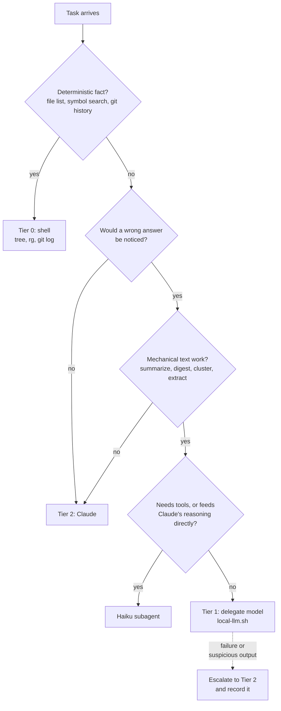
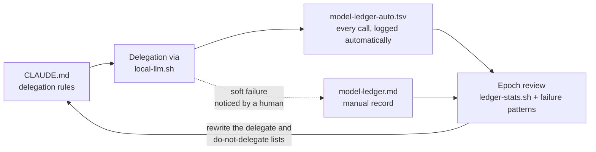

# model-ledger-claude

A CLAUDE.md template for [Claude Code](https://claude.com/claude-code) that treats model capacity as a budgeted resource. It routes work to the cheapest executor that can do it reliably, escalates loudly when that executor is not enough, and keeps a written ledger of every escalation so the routing rules are calibrated by evidence instead of intuition.


There is also a [46-second intro video](https://github.com/inthepond/model-ledger-claude/releases/latest/download/intro.mp4); both are rendered with [Remotion](https://www.remotion.dev) from the source in [video/](video/).

## What is a CLAUDE.md?

Claude Code automatically injects the `CLAUDE.md` at a project's root into the context of every request. It is the standard place for project-specific instructions: build commands, conventions, and rules for how the agent should work. Because it is re-sent on every turn, every line in it has a recurring token cost. This template takes that constraint seriously: its very first rule is a comment telling you to delete anything that is not worth paying for on every turn.

## The idea

Most agent workflows send everything, including trivial mechanical work, to the most capable (most expensive) model. This setup splits work into three tiers and defaults to the lowest one that is viable:

| Tier | Work | Executor |
|---|---|---|
| 0 | Deterministic facts: file trees, grep, git history, formatting | Shell tools (`tree`, `rg`, `git log`), no model at all |
| 1 | Mechanical text work: single-file summaries, log digests, commit clustering | A local model via Ollama |
| 2 | Judgment, trade-offs, cross-file reasoning, writing, architecture | Claude itself |

Two principles hold the system together:

1. **One delegation criterion.** A task may only be pushed down a tier if a wrong answer would be noticed. "If this output were wrong and I would not notice, do not delegate it."
2. **Fail loudly, escalate, and write it down.** Lower tiers never retry or silently degrade. They stop, report why they are stuck, and the task moves up a tier. Every Tier 1 invocation is auto-logged (successes included, so failure counts have denominators), every escalation becomes a ledger row, and periodic reviews rewrite the delegation rules.

## The routing decision

Every task runs through the same short decision path. The single check doing the real work is verifiability: delegation is only safe when a wrong answer would be caught.



## The calibration loop

The delegation rules are hypotheses, not doctrine. Every script invocation logs itself, every soft failure gets a hand-written ledger row, and reviews turn the accumulated evidence into edits to the rules. This loop is what separates the setup from a static prompt file.



Reviews happen at model epochs (whenever a model version changes) and whenever soft failures accumulate; three soft failures in one task type are enough to pull that category from the delegation list.

## What the tiers cost

Illustrative arithmetic using Anthropic's published API prices as of mid-2026 (Claude Opus 5: $5 per million input tokens, $25 per million output; prompt-cache reads at roughly 0.1x the input price) and this repo's actual file sizes. Recompute for your own model and traffic; the point is the orders of magnitude, not the third decimal.

**The CLAUDE.md tax.** This template is about 5.4KB, roughly 1,400 tokens. It rides along on every request: about $0.007 per uncached turn on Opus 5, about $0.0007 per cached turn, so around $7 across 10,000 mostly-cached turns in a month. That sounds small until you notice that CLAUDE.md files in the wild are commonly 4 to 6 times longer and full of lines the model never acts on. The template's opening comment ("is this rule worth paying for on every turn?") is that multiplication applied line by line.

**Context dumped into an agent is re-billed on every later turn.** Suppose a failing CI run produces a 200KB log, about 50,000 tokens:

| Approach | What enters Claude's context | Rough cost over a 40-turn session |
|---|---|---|
| Tier 0: `grep -i error ci.log` | A handful of matched lines | Effectively zero |
| Tier 1: `local-llm.sh "List each failure" < ci.log` | A ~500-token digest | About $0.01 |
| Tier 2: paste the log into the session | All 50,000 tokens, re-read (at cache rates) on every later turn | Over $1 |

A dollar per session sounds trivial; multiply it by every log, diff, and changelog across every session. The context-window cost compounds it: those 50,000 tokens also crowd out room the agent needs for actual work.

**Why soft failures dominate the ledger.** One wrong-but-fluent digest that sends Claude down a false debugging path costs a full round trip of reasoning and tool calls at output prices ($25 per million tokens), plus your time reviewing the wrong fix. A single soft failure can erase the savings of a hundred successful delegations. That asymmetry is why the ledger treats `soft` as the expensive category, and why the delegation criterion asks whether errors get noticed rather than whether the task is hard.

## Use cases

Each recipe names its tier and, more importantly, its verification signal, because the delegation criterion lives or dies on whether a wrong output would be noticed.

**Release notes from commit history (Tier 1 feeding Tier 2).**

```bash
git log --oneline v1.4.0..HEAD | ./scripts/local-llm.sh "Cluster these commits by theme; list each theme with its commit hashes"
```

The delegate model does the mechanical clustering; Claude writes the actual release notes from the clusters. The finished text stays at Tier 2 because it is external-facing. Verification: the hashes are checkable, and a commit filed under the wrong theme is obvious at a glance.

**CI log triage (Tier 1).**

```bash
./scripts/local-llm.sh "List each distinct test failure with its test name and error message" < ci.log
```

Only the digest enters Claude's context instead of the whole log (see the cost table above). Verification is a hard signal: re-run the named tests. If the digest names a test that does not exist, you find out immediately.

**Breaking-change briefing before a dependency upgrade (Tier 1).**

```bash
curl -s https://raw.githubusercontent.com/ORG/REPO/main/CHANGELOG.md | ./scripts/local-llm.sh "List the breaking changes between v5 and v6"
```

Verification comes nearly free: the build either breaks or it does not, and Claude reads the relevant changelog sections directly for anything load-bearing.

**"Find every TODO" (Tier 0, the trap case).** This looks like an LLM task and is not one:

```bash
rg -n "TODO|FIXME"
```

Deterministic facts never go to a model, including the delegate. This is the most common misroute in practice, and it is free to get right.

**Writing the PR description (Tier 2 only, the counter-case).** Summarizing a diff sounds mechanical, but the output is finished text aimed at external readers, and a subtle mischaracterization would ship unnoticed. It fails the criterion, so it is never delegated.

## Files

- **`CLAUDE.md`**: the template itself. Contains the tiering rules, the delegation and escalation protocols, subagent model selection (`haiku` / `sonnet` / `opus`), session hygiene rules, and output conventions. Fill in the Project section with your own stack and commands.
- **`local-llm.sh`**: the Tier 1 wrapper around `ollama run`. It refuses oversized input instead of truncating it, enforces a timeout, exits non-zero with a stderr message on any failure (surfacing ollama's own error output) so the agent can never mistake garbage for a result, and appends one row per invocation, success or failure, to `docs/model-ledger-auto.tsv`. Configurable via `LOCAL_LLM_MODEL` (default `kimi-k2.7-code:cloud`), `LOCAL_LLM_TIMEOUT`, `LOCAL_LLM_MAX_CHARS`, and `LOCAL_LLM_LOG`.
- **`ledger-stats.sh`**: turns the auto-log into the numbers the epoch review needs: overall and per-model success rates, per-instruction success, failure rate by input-size bucket, and mean duration. No dependencies beyond awk.
- **`model-ledger.md`**: the manual half of the evidence record. The auto-log captures denominators and hard failures (crashes, timeouts, red tests) by itself; this file records what automation cannot see: `soft` failures (fluent but wrong, the most expensive kind), `unknown` failures, and subagent escalations. Reviews happen at model epochs (whenever a model version changes) rather than on a fixed row count, and three soft failures in one task type are enough to pull that category from the delegation list.

## Setup

1. Copy `CLAUDE.md` to your project root and fill in the Project section.
2. Copy the two scripts into `scripts/` and make them executable:

   ```bash
   mkdir -p scripts docs
   cp local-llm.sh ledger-stats.sh scripts/
   chmod +x scripts/local-llm.sh scripts/ledger-stats.sh
   cp model-ledger.md docs/
   ```

3. Install [Ollama](https://ollama.com), make sure `ollama serve` is running, and pull a model for Tier 1. The default is Moonshot AI's `kimi-k2.7-code:cloud`. Note that Kimi models on Ollama are cloud-only (the K-series is around 1T parameters, far too large for a laptop), so this tag runs on Ollama Cloud through the same `ollama run` interface and requires being signed in to an ollama.com account:

   ```bash
   ollama pull kimi-k2.7-code:cloud
   ```

   If you want Tier 1 to be fully local and offline, point `LOCAL_LLM_MODEL` at any non-cloud tag instead (for example `gemma3:12b` or `qwen3-coder`). Note that Kimi cloud tags may require a paid Ollama subscription; a free account gets `Error: 403 Forbidden` at run time, which the script surfaces and logs as a hard failure.

   The script guards each call with `timeout` or `gtimeout`. macOS ships neither; install coreutils (`brew install coreutils`) to get `gtimeout`, otherwise calls run unguarded and the script warns on every invocation.

4. Try it (from the repo root, so the auto-log lands in `docs/model-ledger-auto.tsv`; it is created on first run):

   ```bash
   git log --oneline -50 | ./scripts/local-llm.sh "Cluster these commits by theme"
   ```

5. After some real use, read your own numbers:

   ```bash
   ./scripts/ledger-stats.sh
   ```

   Sample output (illustrative):

   ```text
   invocations: 214    successes: 197 (92%)
   mean duration of successes: 6.4s

   by model:
     kimi-k2.7-code:cloud           197/210 ok (94%)
     gemma3:12b                     0/4 ok (0%)

   by instruction (first 44 chars):
     Cluster these commits by theme               58/58 ok
     List each distinct test failure with its te  71/74 ok

   failure rate by input size (chars):
     under 10k      1/102 failed
     50k to 100k    9/38 failed
   ```

   This is the evidence the review questions in `model-ledger.md` ask for: which task types are safe to lock in as default delegations, and whether failures cluster by model or by input size (in which case tune `LOCAL_LLM_MAX_CHARS` rather than switching models).

## Porting this to your harness

Only one piece of this repo is Claude Code specific: the instructions file. The script, the auto-log, the ledger, and the delegation criterion are plain files and shell, and work under any agent harness that can run commands.

| Piece | Claude Code | Elsewhere |
|---|---|---|
| Instructions file | `CLAUDE.md` | `AGENTS.md` (Codex CLI and other harnesses adopting that convention), `.cursor/rules` (Cursor), `CONVENTIONS.md` (Aider). Check your harness's docs for the exact name and location. |
| Tier 1 script + auto-log | `scripts/local-llm.sh` | Unchanged |
| Ledger + review | `docs/model-ledger.md` + `scripts/ledger-stats.sh` | Unchanged |
| Subagent tiers | `haiku` / `sonnet` / `opus` | Map to your harness's model options, or delete the section if it has no subagents |
| Session hygiene | `/clear`, `/compact` | Your harness's equivalents |

When porting the instructions file, keep the two load-bearing parts intact: the delegation criterion ("if this output were wrong and I would not notice, do not delegate") and the fail-loud escalation with logging. Everything else is tuning.

## Session hygiene

These are habits for the human driving the session, not instructions for the model; Claude cannot run `/clear` or `/compact` itself, so keeping them in CLAUDE.md meant paying every turn for lines the only actionable reader never re-reads. They live here instead:

- Run `/clear` before switching to an unrelated task.
- Use `/compact` when the context grows large.
- Long sessions are the main source of spend; prefer a fresh session over dragging old context along.
- Switching models mid-session reprocesses the entire history and invalidates the prompt cache; do not switch often.

## Development

```bash
shellcheck local-llm.sh ledger-stats.sh tests/run-tests.sh
bash tests/run-tests.sh
```

The test suite has no dependencies: it replaces `ollama` with a fake on PATH and runs everything in a temp directory. CI runs shellcheck and the suite on every push. The timeout test skips itself when neither `timeout` nor `gtimeout` is on PATH (stock macOS).

## Customizing

Everything in `CLAUDE.md` is a starting point, not doctrine. In particular:

- The Output Conventions section encodes the original author's personal preferences (for example, conversing in Chinese). Replace them with your own.
- The delegate / do-not-delegate lists are meant to drift over time. That is what the ledger is for: let your own failure records, not this repo, decide what your local model can be trusted with.
- If failures cluster at a certain input size, tune `LOCAL_LLM_MAX_CHARS` before blaming or replacing the model.

## License

MIT. See [LICENSE](LICENSE).
